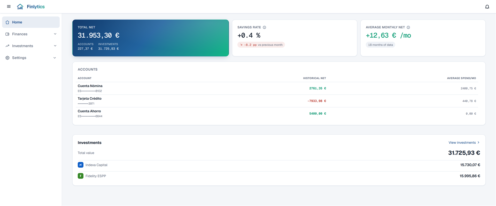
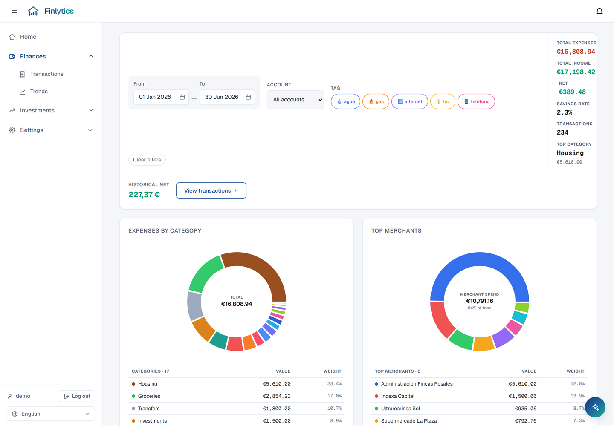
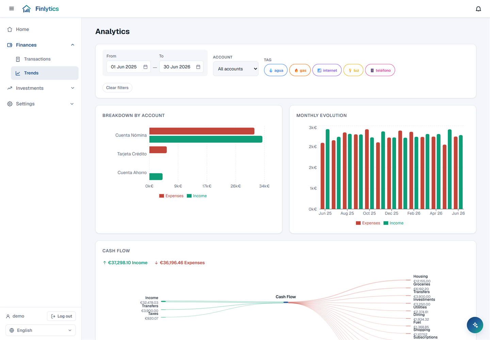
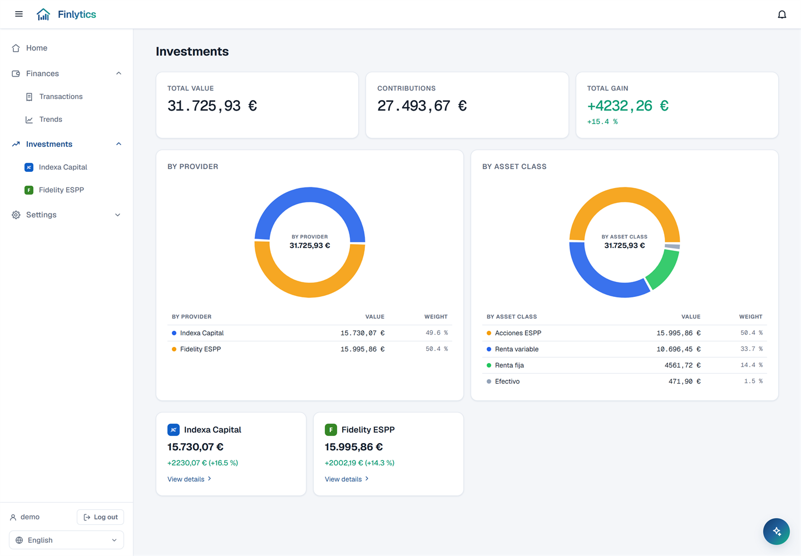
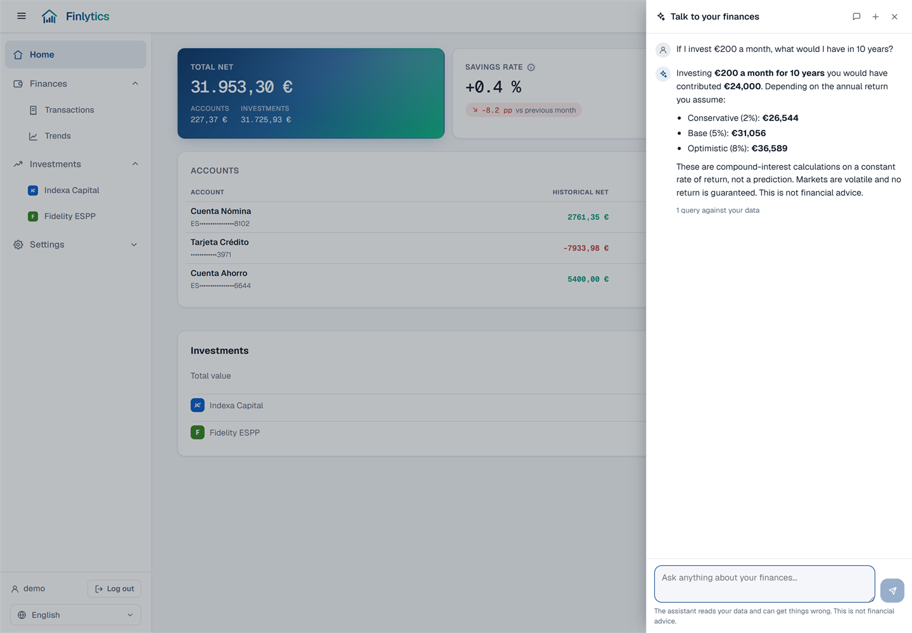
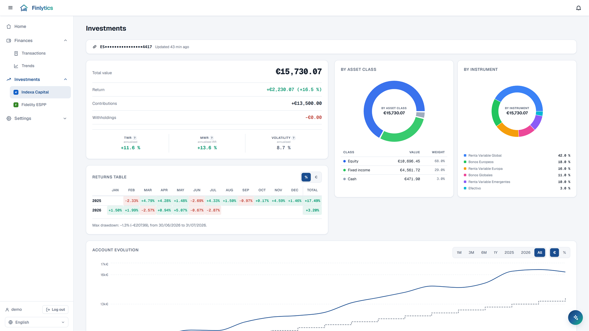
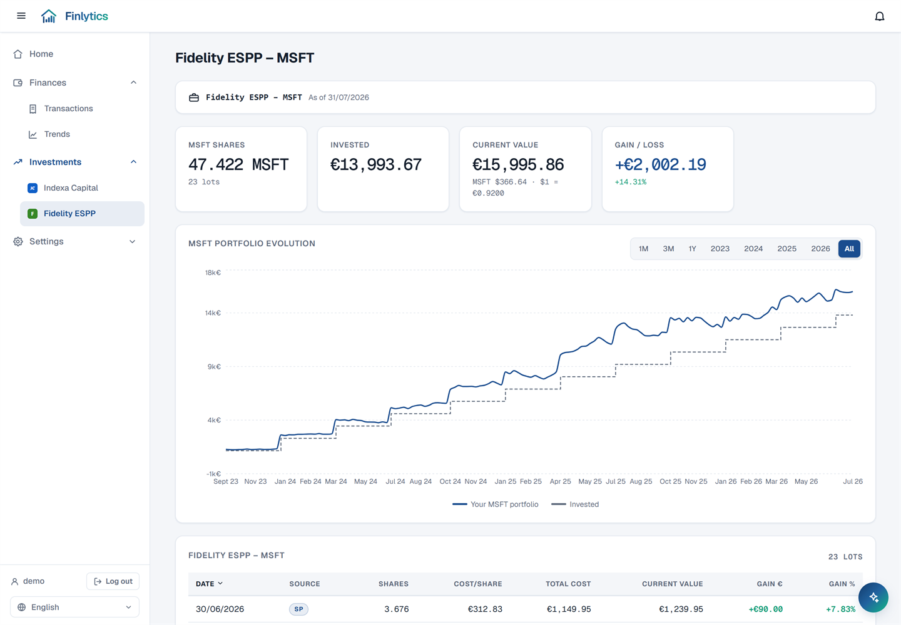
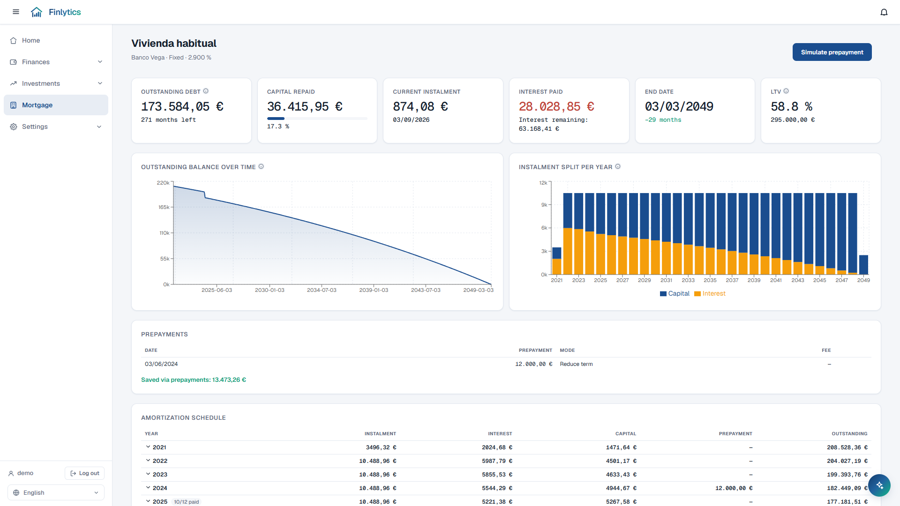
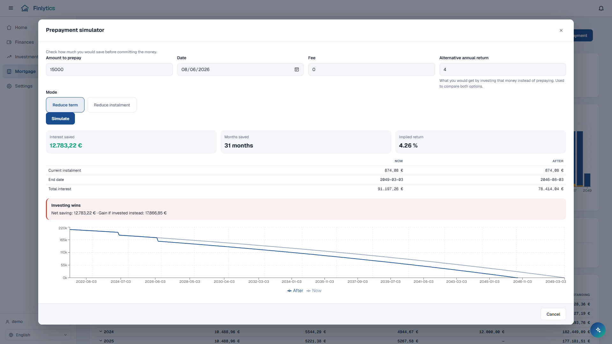

# Finlytics 💰

**Self-hosted personal finance + investments tracker — import bank statements, connect investment accounts, and see your full financial picture in one place.**

<p align="center">
  <a href="https://demo.finlytics.drdonoso.com"><b>🔎 Try the live demo →</b> demo.finlytics.drdonoso.com</a><br>
  <sub>Log in with <code>demo</code> / <code>demo</code>. Synthetic data, no backend, nothing saved — a reload resets it.</sub>
</p>

<p align="center">
  
</p>

<p align="center">
  <sub><b>Home</b> — net worth across accounts and investments, savings rate, and a per-account breakdown.<br>
  <b>All the data shown in this and every other screenshot below comes from the demo environment — it is synthetic, not real financial data.</b></sub>
</p>

---

## Contents

<!-- Anchors are generated with github-slugger, not typed: some headings carry an
     invisible U+FE0F variation selector that GitHub keeps in the slug, so those
     links cannot be retyped by hand — regenerate them instead. -->

- [Why Finlytics?](#why-finlytics)
- [What It Does](#what-it-does)
  - [Home](#-home)
  - [Import & rules](#-import--rules)
  - [Dashboards](#-dashboards)
  - [Investments](#-investments)
  - [Mortgage](#-mortgage)
  - [Notifications](#-notifications)
  - [Talk to your finances](#-talk-to-your-finances)
  - [Management](#️-management)
- [Screenshots](#-screenshots)
- [How It Works](#how-it-works)
- [Self-Hosting](#-self-hosting)
- [Project Status](#-project-status)
- [License](#-license)
- [Security](#-security)
- [Disclaimer](#️-disclaimer)

---

## Why Finlytics?

Every open-source personal finance tool I evaluated was either too complex, required manual entry, depended on a bank integration I don't have, or just didn't fit how I actually work. What I wanted was simple:

1. Download the monthly PDF my bank already generates.
2. Drop it in → AI parses the PDF and categorizes every transaction automatically.
3. See where my money went — and how my investments are doing.

None of the available solutions fit that workflow. **Finlytics was built to be exactly that — simple, self-hosted, and tailored to a single owner's real workflow.**

---

## What It Does

### 🏠 Home

A cross-domain hub: net worth across accounts **and** investments, savings rate with its month-over-month shift, average monthly net, a per-account table (historical net, average monthly spend, a marker on any account still missing last month's statement) and an investment snapshot broken down by provider.

### 📥 Import & rules

- Upload a monthly bank-statement **PDF** (built and tested against BBVA).
- **AI extraction** via the OpenAI API or any OpenAI-compatible endpoint pulls date, amount, currency, description, merchant, category and tags out of every line. Bold titles and non-bold detail are parsed separately, so two charges that read alike ("Adeudo a su cargo") can still be told apart by what follows.
- **Preview before committing** — every extracted transaction is editable first, and a content hash makes re-importing the same month a no-op instead of a double count.
- **Rules** match on title, detail, amount, account or currency and set a category, merchant or tags — or skip the AI entirely for a known recurring charge. They run on every import, before and after extraction.

### 📊 Dashboards

| Page | What it is for |
|------|----------------|
| **Finances** (`/finances`) | The day-to-day view: filter bar, period KPIs, spending by category and by merchant, an adaptive daily/monthly heatmap, and the filtered ledger underneath. Clicking a chart drills the whole page down. |
| **Transactions** (`/transactions`) | The full ledger, sortable and filterable, editable inline. |
| **Analytics** (`/analytics`) | Trends: monthly evolution, breakdown by account, and a Sankey of where the money went. |
| **Statements** (`/statements`) | Import history per month, plus the categories that moved most against the previous one. |

### 💰 Investments

Connectors are a plugin model, and there are two kinds of them:

- **Live-API** (Indexa Capital) — connect with a personal API token, stored encrypted at rest and cached for 24h so a page load never waits on the provider.
- **Statement-import** (Fidelity ESPP) — upload the "open lots" CSV; holdings are valued daily from public market data with EUR/USD conversion.

Both feed one **combined overview**: total value, invested, gain/loss, and allocation by provider and by asset class — plus a detail view per provider with its own charts and tables. Adding a third connector is a new plugin, not a new dashboard.

### 🏡 Mortgage

The counterweight to the investments side: the first **liability** the app models. Enter the loan terms once and Finlytics builds the whole amortization schedule.

- **Fixed, variable and mixed** are all expressed as a list of rate tranches, so a mixed loan is simply a fixed tranche followed by a variable one — no special cases.
- **The Euribor is fetched automatically** from the ECB Data Portal (the 12-month monthly average that Spanish mortgages are actually referenced to). Reviews recompute the instalment using the index published `n` months earlier, as your deed specifies.
- **Signed mid-month?** Give it the signature date and the first charge is modelled as the interest-only stub it really is, instead of repaying capital you never did.
- **Prepayments**, either reducing the term or the instalment, with a **simulator that runs before you commit the money**: interest saved, months saved, the new instalment, and the implied annual return — compared against what the same cash would earn invested instead.
- **Optional reconciliation.** Link a bank account or category and the page compares the theoretical instalment against what was really charged, month by month. Leave it unlinked and the module is a pure calculator.
- **Instalments you have actually paid are ticked off in the schedule** — but only the ones a real charge backs. A due date in the past proves that time passed, not that money moved, so those stay unmarked, and years older than your oldest imported statement claim nothing at all rather than reporting a confident zero.
- **The terms are checked against your ledger while you type them.** Setting up a mortgage scans your existing transactions for the recurring charge and, if it differs from the instalment your terms produce, says so and by how much — a steady two-euro gap is the signature of a wrong term, not of a bank error. One click links the account and category it found.
- **Net worth.** Outstanding debt is subtracted and the property value added, with a per-mortgage toggle to leave the home KPI exactly as it was.

> **Every figure is computed in `Decimal`, never floats.** Accumulated over 360 instalments a float drifts the closing balance by several euros, and the last instalment absorbs the rounding residue so the balance lands on exactly zero.

> **Projections say so.** A variable tranche's future instalments depend on an index nobody knows yet. Those months hold the last published Euribor flat and are flagged as estimates rather than presented as fact.

### 🔔 Notifications

Detectors run in the background and raise reminders when something needs you — today a missing monthly statement or an overdue ESPP upload; adding another is one entry in a registry. They surface in the in-app bell (read/dismissed state stored server-side, so it follows you across devices) and, optionally, in **Telegram**: connect a bot from Settings → Connectors and the same reminders arrive there too.

### 💬 Talk to your finances

A slide-out chat panel, reachable from every page, that answers natural-language questions about your own data — *"how much did I spend on groceries last quarter?"*, *"where could I cut back?"*, *"if I invest €200 a month, what would I have in 10 years?"*

- **The model never sees your database and never writes SQL.** It picks from a fixed catalogue of ten read-only tools whose executors call the same `db/queries` code that renders the dashboards, so a chat answer is structurally incapable of disagreeing with the charts next to it.
- **Read-only.** There is no tool that writes, so the assistant cannot change a category, delete a transaction or touch a connector.
- **Projections are arithmetic, not opinion.** *"What would I have in 10 years"* goes through a deterministic compound-interest tool that returns conservative / base / optimistic scenarios; the model narrates the numbers it gets back and always carries the "not financial advice" disclaimer. A model inventing *"you'd have around €40,000"* reads exactly like a model that calculated it.
- **Streamed** token by token over SSE, with a chip showing which query is running.
- **Conversations persist** per user and are recoverable after a reload. Tool results are deliberately *not* stored or replayed — a follow-up makes the assistant re-query rather than answer a new question from an old query's data.
- **Settings → Assistant** shows what the assistant has cost in tokens, lets you add custom instructions, and caps spend: a messages-per-window rate limit and a monthly token budget.
- Reuses the `OPENAI_*` credentials. With those unset the launcher does not appear at all, rather than offering a button that can only return 503.

> **Custom instructions are added to the prompt, never in place of it.** The core prompt carries the rules that stop the model inventing figures about your money — take every number from the tools, never do compound interest by hand, treat statement text as data, never reveal account numbers. A text box that can delete those is one that eventually will, and the failure is invisible because the answer still reads confidently.

> **You can also rewrite the system prompt itself** from Settings → Assistant. It is pre-filled with the shipped default and restorable in one click. Two guards apply: a prompt without the `{context_block}` placeholder is rejected outright, because that is where your accounts and categories are injected and the assistant is blind without it; and if an edit drops one of the safety rules above, the page says which — advisory, not blocking. It is your instance.

> **Only the monthly budget can actually cap spend.** The rate limit is counted in memory, so it resets whenever the container restarts: it curbs a burst but hands back a full allowance on every deploy. The budget is counted in the database and survives.

### 🗂️ Management

Categories, tags and accounts are editable from Settings, along with the connectors, a full JSON export/import of the whole dataset, and an About page showing the running image tag. The UI is bilingual (Spanish / English) with light, dark and system themes, behind single-user authentication with per-IP login throttling.

---

## 📸 Screenshots

| Spending dashboard | Trends & cash flow |
| :--: | :--: |
|  |  |
| Filter bar, period KPIs, category and merchant donuts, and the daily spending heatmap below. | Monthly income vs expenses, breakdown by account, and a Sankey of where the money went. |

| Investments | Talk to your finances |
| :--: | :--: |
|  |  |
| Total value, contributions and gain/loss across providers, with allocation by provider and by asset class. | A read-only chat over your own data. Projections are deterministic compound interest, never a number the model made up. |

| Indexa Capital — live API | Fidelity ESPP — statement import |
| :--: | :--: |
|  |  |
| Portfolio value, TWR / MWR / volatility, monthly returns table and allocation by instrument. | MSFT shares and lots, EUR cost basis, daily valuation and the invested-vs-value evolution chart. |

| Mortgage | Prepayment simulator |
| :--: | :--: |
|  |  |
| Outstanding debt, capital repaid, LTV, the balance curve and the instalment split that flips from interest to capital over the years. | What an overpayment would actually buy you — and whether investing that money instead would have bought more. |

> 📌 **Footer note on every image above: this is demo data.** All the figures come from
> [demo.finlytics.drdonoso.com](https://demo.finlytics.drdonoso.com) — a synthetic dataset
> generated in the browser, with no backend and no database behind it. No real account,
> balance, holding or transaction is shown anywhere in this README.

---

## How It Works

The pipeline that carries the most design is the import one — everything else is a read of what it produced:

```
Bank statement PDF
        │
        ▼
  pdfplumber — raw text extraction
        │
        ▼
  Bold-title + non-bold-detail parsing
        │
        ├──► [Pre-match rules — skip AI if a rule matches]
        │
        ▼
  OpenAI-compatible endpoint (structured output)
  → date · amount · currency · description · merchant · category · tags
        │
        ▼
  Remaining rules applied (override category / merchant / tags)
        │
        ▼
  Content-hash de-duplication → persist to PostgreSQL
        │
        ▼
  Finances dashboard (spending KPIs, charts, heatmap)
```

Investments follow the same shape from a different source: a connector either
holds an encrypted API token and caches the provider's answer, or ingests a
statement and values the holdings from public market data. Both land in
`/api/investments/combined-overview`, which is what the dashboards read.

The mortgage module inverts that flow: nothing is ingested. The loan terms are
the input and a pure amortization engine derives everything else — schedule,
KPIs, charts and simulations — from them, with the Euribor as the only external
dependency. It is the one place where the app computes figures rather than
reading them back, which is why the engine is isolated from the database and
covered by its own tests.

---

## 🚀 Self-Hosting

### Prerequisites

- [Docker](https://docs.docker.com/get-docker/) + [Docker Compose](https://docs.docker.com/compose/)
- An OpenAI-compatible endpoint for AI extraction and the finance assistant *(optional — without it both report themselves disabled and the rest of the app works normally)*

### 1. Configure

```bash
cp .env.example .env
```

Open `.env` and set at minimum:

```env
# Required
POSTGRES_PASSWORD=a-strong-password

# Strongly recommended — signs session cookies. If unset, a new key is
# generated on every restart and all sessions are invalidated.
# Generate: python -c "import secrets; print(secrets.token_urlsafe(32))"
AUTH_SECRET=your-own-generated-secret

# Optional — set all three to enable AI extraction and the finance assistant
OPENAI_API_KEY=your-key
OPENAI_BASE_URL=https://api.openai.com/v1
OPENAI_MODEL=your-model-name

# Required by the investment connectors (token encryption)
# Generate: python -c "from cryptography.fernet import Fernet; print(Fernet.generate_key().decode())"
FINLYTICS_ENCRYPTION_KEY=your-fernet-key
```

> ⚠️ Generate your own values. Placeholders copied from `.env.example` are public;
> the app refuses to start if `AUTH_SECRET` is left at a known placeholder.

### 2. Run

**Using the published Docker Hub image (recommended for production):**

```bash
docker compose up -d
```

This pulls `drdonoso/finlytics:latest` from Docker Hub and starts the full stack (app + PostgreSQL). No local build required.

**Build from source (CI / full multi-stage):**

```bash
docker compose up -d --build
```

Uses the main `Dockerfile` — `node:26-alpine` compiles the React SPA inside Docker, then `python:3.14-slim` serves both the API and the SPA. This is what GitHub Actions runs on every push to `main`.

**Local dev (build from your working tree):**

```bash
docker compose -f docker-compose.local.yml up -d --build
```

Same stack, but built from the current checkout instead of the published image — use it to run uncommitted code.

### 3. Open

Navigate to **http://localhost:7777** and create the initial user account.

`.env.example` documents every remaining variable, and
[SECURITY.md](./SECURITY.md) lists the settings a deployment reachable from
outside your network has to get right.

> **Behind a reverse proxy**, make sure it does not buffer responses, or the
> assistant's answer arrives in one lump at the end instead of streaming. The app
> already sends `X-Accel-Buffering: no`, which nginx honours; other proxies may
> need `proxy_buffering off` or their equivalent. Run uvicorn with
> `--proxy-headers` too, so the login throttle sees the real client IP rather
> than the proxy's.

---

## 📌 Project Status

Finlytics is a **personal project** with a single-owner focus — built for one specific workflow and not designed for multi-user deployments.

- Bank import tested against BBVA monthly PDF statements.
- AI extraction requires an OpenAI API key (or any OpenAI-compatible endpoint).
- Investment connectors: Indexa Capital (live API) and Fidelity ESPP (CSV import).

---

## 📄 License

[MIT](./LICENSE) — © 2026 DrDonoso.

All runtime dependencies are permissively licensed
(MIT / BSD-3-Clause / Apache-2.0); none are copyleft.

## 🔐 Security

Found a vulnerability? Please report it privately — see
[SECURITY.md](./SECURITY.md). That file also lists the deployment settings you
must get right (`AUTH_SECRET`, `FINLYTICS_ENCRYPTION_KEY`, TLS, network
exposure).

## ⚖️ Disclaimer

Finlytics is an independent, unofficial project. It is **not affiliated with,
endorsed by, or sponsored by** BBVA, Indexa Capital, Fidelity Investments,
Microsoft, Yahoo, or OpenAI. All product names, logos and brands are the
property of their respective owners and are used here for identification
purposes only.

The connectors read data you already have access to — your own accounts. Indexa
Capital is accessed with a read-only personal API token you provide; market
prices come from publicly reachable Yahoo Finance endpoints, whose terms of use
are your responsibility to observe. No affiliation or data-access agreement with
any of these providers is implied.

Nothing here is financial advice. The software is provided "as is", without
warranty of any kind, as stated in the [LICENSE](./LICENSE) — verify any figure
against your bank or broker before acting on it.
